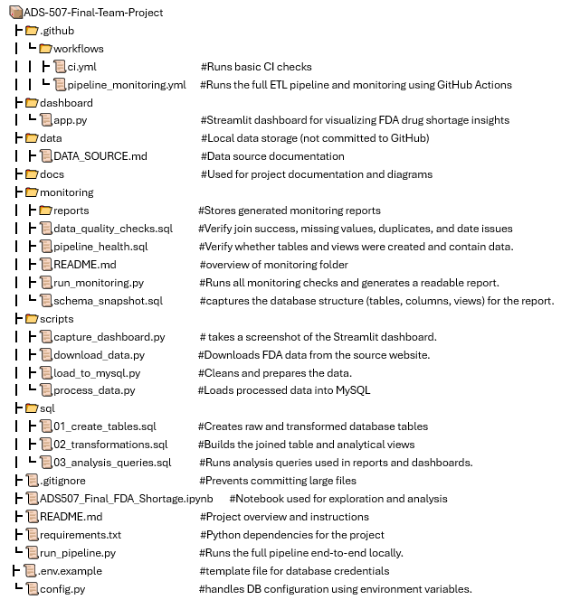

# ADS-507 Final Team Project
## FDA Drug Shortage Analysis Pipeline

### Team Members
- Mark Villanueva
- Nancy Walker
- Sheshma Jaganathan

---

## Project Overview

This project builds a MySQL-based data pipeline that combines two FDA datasets (National Drug Code database and Drug Shortages) to enable enriched analysis. By joining these datasets, we can answer questions that aren't possible with either dataset alone, such as:
- Which manufacturers have the highest shortage risk?
- Do branded drugs have longer shortage durations than generics?
- Which package types are most vulnerable to shortages?

---

## Repository Structure



---

## Prerequisites

Before running the pipeline, ensure you have:

1. **Python 3.8+** installed
   - Check: `python3 --version` (macOS/Linux) / `python --version` (Windows)
   - Download: https://www.python.org/downloads/

2. **MySQL Server** installed and running
   - MySQL Workbench (recommended for running SQL scripts)
   - Download: https://dev.mysql.com/downloads/

3. **Git** (for cloning repository)
   - Download: https://git-scm.com/downloads

---

## Setup Instructions

### Step 1: Clone the Repository
```bash
git clone https://github.com/ngwalker93/ADS-507-Final-Team-Project.git
cd ADS-507-Final-Team-Project
```
## Step 2: Create and Activate Virtual Environment

### Create venv MacOS/Linux
```bash
python3 -m venv .venv
source .venv/bin/activate
````

### Create venv Windows (PowerShell)
```powershell
python -m venv .venv
```

> If activation is blocked, run the ExecutionPolicy command first.

```powershell
Set-ExecutionPolicy -Scope Process -ExecutionPolicy Bypass
.\.venv\Scripts\Activate.ps1
```
## Step 3: Configure Environment Variables 
This project uses environment variables to securely manage database credentials.
Database passwords are not stored in the source code

### Create a .env file 
In the root directory of the project create a file named: 

```
.env
```

Create manually or copy the template 

#### macOS/Linux
```bash
cp .env.example .env
```
#### Windows (PowerShell)
```powershell
Copy-Item .env.example .env
``` 

### Replace the values with your local MySQL credentials

Add the following variables: 
```
DB_USER=your_mysql_username
DB_PASSWORD=your_mysql_password
DB_HOST=127.0.0.1
DB_PORT=3306
DB_NAME=fda_shortage_db
```

**DO NOT Commit** .env
The file is excluded from version control via .gitignore because it contains sensitive credentials.

The pipeline loads `.env` automatically via `python-dotenv` (no manual export needed).

## Step 4: Install Python Dependencies

```bash
python -m pip install --upgrade pip
python -m pip install -r requirements.txt
```

## Pipeline Execution in Order

### Phase 1: Create MySQL Database
```powershell
mysql -u root -p -e "CREATE DATABASE IF NOT EXISTS fda_shortage_db;"
```

### Phase 2: Create Database Tables

#### macOS/Linux 
```bash 
mysql -u root -p fda_shortage_db < sql/01_create_tables.sql
```

#### Windows (PowerShell)
```powershell
Get-Content .\sql\01_create_tables.sql | mysql -u root -p fda_shortage_db
```

*Expected output:
Creates 4 raw tables:raw_ndc, raw_ndc_packaging, raw_drug_shortages,shortage_contacts*

### Phase 3: Download Raw FDA Data

```powershell
python -m scripts.download_data

```

*Expected output:
Downloads FDA NDC dataset (~119 MB),Downloads FDA Drug Shortages dataset,Stores raw files in data*

**Expected output files:*
data/drug-ndc-0001-of-0001.json
data/drug_shortages_raw.json**

### Phase 4: Process and Clean Data

```powershell
python -m scripts.process_data

```


**output csv files :*

**data/ndc_core.csv*
data/ndc_packaging.csv
data/drug_shortages_core.csv
data/shortage_contacts.csv**

### Phase 5: Load Data into MySQL

```powershell
python -m scripts.load_to_mysql
```

*Expected output
Loads CSVs into MySQL tables,Clears existing rows safely,Verifies row counts after load*

### Phase 6: Run SQL Transformations

#### macOS/Linux
```bash
mysql -u root -p fda_shortage_db < sql/02_transformations.sql
```

#### Windows (PowerShell)
```powershell
Get-Content .\sql\02_transformations.sql | mysql -u root -p fda_shortage_db
```

*Expected output:
Joins shortages with NDC data,Creates enriched views for analysis,current_package_shortages,multi_package_shortages, manufacturer_risk_analysis,current_manufacturer_risk*

### Phase 7:Run monitoring checks

```powershell
python -m monitoring.run_monitoring

```
**Expected result:** Running this script generates monitoring reports and saves them to the `monitoring/reports/` folder.
* `monitoring/reports/monitoring_report.md`  
* `monitoring/reports/monitoring_report.txt`
  
### Phase 8:Run the Streamlit dashboard (local)

Ensure your .env file is configured (see Step 3).

### Start the dashboard

```powershell
python -m streamlit run dashboard/app.py

```
-----
# **Automated Pipeline Execution and Monitoring via GitHub Actions**

 This project uses GitHub Actions to run the full ETL pipeline and generate monitoring reports automatically.

### Step 1: Trigger the Pipeline

- Go to the GitHub repository
- Click the Actions tab [](https://github.com/ngwalker93/ADS-507-Final-Team-Project/actions/workflows/pipeline_monitoring.yml)
- Select **Pipeline Monitoring**
- Click **Run workflow**
- Keep all default options and click **Run workflow**

  This triggers raw data ingestion, data processing, loading into MySQL, SQL transformation and monitoring checks in one click.

  ### Step 2: View Monitoring Results and Download Monitoring Artifacts

  After the automated pipeline completes, monitoring outputs are provided as GitHub Actions artifacts.
  
- Open the latest **Pipeline Monitoring** workflow 
- Navigate to the **Summary**
- Scroll down to the **Artifacts section** in the workflow summary
- Download the **pipeline-artifact** report
- Extract the ZIP file locally

  Included files:
* monitoring_report.md -monitoring summary
* monitoring_report.txt – plain text report
* pipeline.log – execution logs
* streamlit_dashboard.png – dashboard screenshot
  
---  

## Data Sources

- **FDA NDC Database:** https://open.fda.gov/apis/drug/ndc/
- **FDA Drug Shortages:** https://open.fda.gov/apis/drug/drugshortages/

See `data/DATA_SOURCE.md` for detailed documentation.

---

## License

Final project for ADS-507 at University of San Diego
